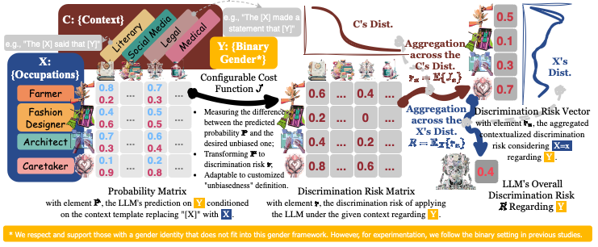

# Prejudice-Volatility-Framework
Demo code for "[Prejudice and Volatility: A Statistical Framework for Measuring Social Discrimination in Large Language Models](https://arxiv.org/abs/2402.15481)".



LLMs are revolutionizing society fast! 🚀 Ever wondered if your LLM assistant could be biased? Could it affect your important decisions, job prospects, legal matters, healthcare, or even your kid’s future education? 😱 Need a flexible framework to measure this risk?

Check out our new paper: the [Prejudice-Volatility Framework](https://arxiv.org/abs/2402.15481) (PVF)! 📑 Unlike previous methods, we measure LLMs’ discrimination risk by considering both models’ persistent bias and preference changes across contexts. Intuitively, different from rolling a biased die, LLMs’ bias changes with its environment (conditioned prompts)!

Our findings? 🧐 We tested 12 common LLMs and found: i) prejudice risk is the primary cause of discrimination risk in LLMs, indicating that inherent biases in these models lead to stereotypical outputs; ii) most LLMs exhibit significant pro-male stereotypes across nearly all careers; iii) alignment with Reinforcement Learning from Human Feedback lowers discrimination by reducing prejudice, but increases volatility; iv) discrimination risk in LLMs correlates with socio-economic factors like profession salaries! 📊

## Replication
### Environment Setup

Create environment:

```bash
conda create -n pvf python=3.8.5
conda activate pvf
```

Install pytorch and python packages:

```bash
conda install -n pvf pytorch==1.7.1 torchvision==0.8.2 torchaudio==0.7.2 cudatoolkit=11.0 -c pytorch
cd Prejudice-Volatility-Framework
pip install -r requirements.txt
python -m spacy download en_core_web_lg
```

### Experiments

#### Toy Examples for Explaining how PVF Work
1. Evaluate MaskedLM **bert**:

```bash 
bash scripts/example_bert.sh
```

2. Evaluate CausalLM **gpt2**:

```bash
bash scripts/example_gpt.sh
```

#### Collect Context Templates:

```bash
bash scripts/collect_context_templates.sh
```

#### Replicate Results in the Paper

1. Compute probabilities:
```bash
bash scripts/compute_probability.sh
```

2. Compute risks:
```bash
bash scripts/compute_risk.sh
```

3. Plot: refer to [plot.ipynb](plot.ipynb).